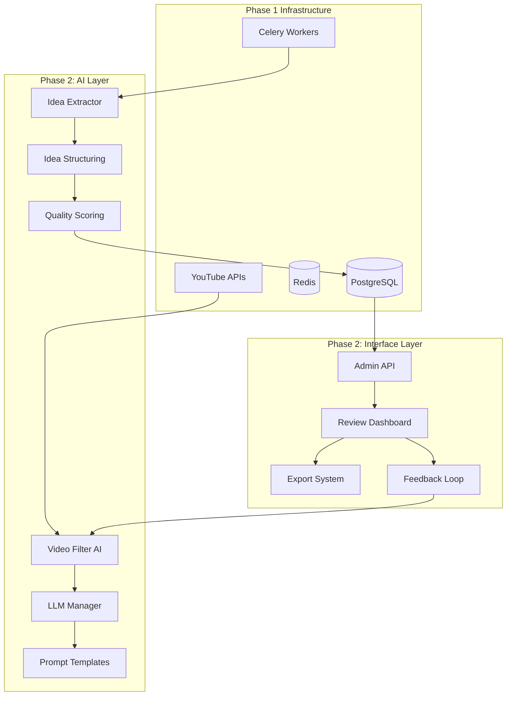

# Phase 2 Development Instructions
## TubeSensei - AI Integration & Content Analysis

---

## 📋 Executive Summary

Phase 2 builds upon the robust infrastructure established in Phase 1 to add intelligent content analysis capabilities. This phase introduces AI-powered video filtering, automated business idea extraction, and a comprehensive admin interface for content review and management.

**Duration:** 4 weeks  
**Dependencies:** Completed Phase 1 infrastructure  
**Key Deliverables:** AI integration, idea extraction system, admin dashboard  

---

## 🎯 Phase 2 Objectives

### Primary Goals
1. **Integrate LLM capabilities** for intelligent content analysis
2. **Implement AI-powered video filtering** to identify high-value content
3. **Extract structured business ideas** from video transcripts
4. **Create admin interface** for review and management
5. **Establish feedback loops** for continuous improvement

### Success Metrics
- Process 500-1000 videos with AI filtering achieving 85%+ accuracy
- Extract 3-5 quality ideas per valuable video
- Reduce manual review time by 70% through intelligent filtering
- Achieve <$0.10 cost per video for AI processing
- Maintain processing speed of 100+ videos/hour

---

## 🏗️ Architecture Overview



---

## 📅 Development Timeline

### Week 1: Phase 2A - LLM Foundation
### Week 2: Phase 2B - AI Video Filtering  
### Week 3: Phase 2C - Idea Extraction Pipeline
### Week 4: Phase 2D - Admin Interface & Review System

---

## 🔧 Phase 2A: LLM Foundation (Week 1)

### Objectives
- Set up multi-provider LLM integration framework
- Implement prompt management system
- Create response parsing and validation
- Add cost tracking and optimization

### Implementation Steps

#### Step 1: Install AI Dependencies
```bash
# Add to requirements.txt
litellm==1.46.0
openai==1.40.0
anthropic==0.31.0
google-generativeai==0.7.2
tiktoken==0.7.0
langchain==0.2.5
langchain-community==0.2.5
```

#### Step 2: Create LLM Manager Module

**File:** `tubesensei/app/ai/__init__.py`
```python
"""AI and LLM integration modules for TubeSensei."""

from .llm_manager import LLMManager
from .prompt_templates import PromptTemplates
from .response_parser import ResponseParser

__all__ = ['LLMManager', 'PromptTemplates', 'ResponseParser']
```

**File:** `tubesensei/app/ai/llm_manager.py`
```python
"""
Multi-provider LLM manager with automatic failover and cost optimization.

This module provides:
- Unified interface for multiple LLM providers
- Automatic failover between providers
- Cost tracking and optimization
- Response caching for duplicate requests
"""

import asyncio
from typing import Dict, List, Optional, Any
from dataclasses import dataclass
from enum import Enum
import json
import hashlib

import litellm
from litellm import acompletion, Router
from redis import asyncio as aioredis
import tiktoken

from ..config import settings
from ..utils.logger import get_logger

logger = get_logger(__name__)

class ModelType(Enum):
    """LLM model types for different use cases."""
    FAST = "fast"  # Quick responses, lower cost (GPT-3.5)
    BALANCED = "balanced"  # Balance of speed and quality (GPT-4-turbo)
    QUALITY = "quality"  # Best quality, higher cost (GPT-4)
    ULTRA_FAST = "ultra_fast"  # Cheapest option (DeepSeek)

@dataclass
class LLMResponse:
    """Structured LLM response with metadata."""
    content: str
    model: str
    provider: str
    tokens_used: int
    cost: float
    cached: bool = False
    processing_time: float = 0.0

class LLMManager:
    """Manages LLM interactions with multiple providers."""
    
    # Model configuration mapping
    MODEL_CONFIG = {
        ModelType.ULTRA_FAST: [
            "deepseek/deepseek-chat",
            "groq/llama-3.1-8b-instant"
        ],
        ModelType.FAST: [
            "gpt-3.5-turbo",
            "claude-3-haiku-20240307",
            "gemini/gemini-1.5-flash"
        ],
        ModelType.BALANCED: [
            "gpt-4-turbo-preview",
            "claude-3-sonnet-20240229"
        ],
        ModelType.QUALITY: [
            "gpt-4",
            "claude-3-opus-20240229",
            "gemini/gemini-1.5-pro"
        ]
    }
    
    def __init__(self):
        """Initialize LLM manager with configured providers."""
        self.redis_client = None
        self.router = self._setup_router()
        self.cost_tracker = {}
        
    def _setup_router(self) -> Router:
        """Set up LiteLLM router with fallback models."""
        model_list = []
        
        # Add OpenAI models if configured
        if settings.OPENAI_API_KEY:
            for model in ["gpt-3.5-turbo", "gpt-4-turbo-preview", "gpt-4"]:
                model_list.append({
                    "model_name": model,
                    "litellm_params": {
                        "model": model,
                        "api_key": settings.OPENAI_API_KEY
                    }
                })
        
        # Add Anthropic models if configured
        if settings.ANTHROPIC_API_KEY:
            for model in ["claude-3-haiku-20240307", "claude-3-sonnet-20240229"]:
                model_list.append({
                    "model_name": model,
                    "litellm_params": {
                        "model": model,
                        "api_key": settings.ANTHROPIC_API_KEY
                    }
                })
        
        # Add other providers...
        
        router = Router(
            model_list=model_list,
            fallbacks={
                "gpt-4": ["gpt-4-turbo-preview", "claude-3-opus-20240229"],
                "gpt-3.5-turbo": ["claude-3-haiku-20240307", "gemini/gemini-1.5-flash"]
            },
            set_verbose=settings.DEBUG,
            num_retries=3,
            timeout=30
        )
        
        return router
    
    async def initialize(self):
        """Initialize Redis connection for caching."""
        self.redis_client = await aioredis.from_url(
            settings.REDIS_URL,
            encoding="utf-8",
            decode_responses=True
        )
    
    async def complete(
        self,
        prompt: str,
        model_type: ModelType = ModelType.FAST,
        temperature: float = 0.7,
        max_tokens: int = 1000,
        use_cache: bool = True,
        system_prompt: Optional[str] = None
    ) -> LLMResponse:
        """
        Get completion from LLM with automatic provider selection.
        
        Args:
            prompt: User prompt text
            model_type: Type of model to use (speed vs quality tradeoff)
            temperature: Creativity parameter (0.0 to 1.0)
            max_tokens: Maximum response tokens
            use_cache: Whether to use cached responses
            system_prompt: Optional system prompt
            
        Returns:
            LLMResponse object with content and metadata
        """
        import time
        start_time = time.time()
        
        # Check cache if enabled
        if use_cache and self.redis_client:
            cache_key = self._generate_cache_key(prompt, model_type, system_prompt)
            cached_response = await self._get_cached_response(cache_key)
            if cached_response:
                cached_response.cached = True
                return cached_response
        
        # Prepare messages
        messages = []
        if system_prompt:
            messages.append({"role": "system", "content": system_prompt})
        messages.append({"role": "user", "content": prompt})
        
        # Get models for this type
        models = self.MODEL_CONFIG.get(model_type, self.MODEL_CONFIG[ModelType.FAST])
        
        # Try each model in order
        for model in models:
            try:
                response = await self.router.acompletion(
                    model=model,
                    messages=messages,
                    temperature=temperature,
                    max_tokens=max_tokens
                )
                
                # Parse response
                content = response.choices[0].message.content
                tokens_used = response.usage.total_tokens
                cost = self._calculate_cost(model, tokens_used)
                
                # Track costs
                self._track_cost(model, cost)
                
                # Create response object
                llm_response = LLMResponse(
                    content=content,
                    model=model,
                    provider=self._get_provider(model),
                    tokens_used=tokens_used,
                    cost=cost,
                    processing_time=time.time() - start_time
                )
                
                # Cache response if enabled
                if use_cache and self.redis_client:
                    await self._cache_response(cache_key, llm_response)
                
                logger.info(f"LLM completion successful",
                          model=model,
                          tokens=tokens_used,
                          cost=cost,
                          time=llm_response.processing_time)
                
                return llm_response
                
            except Exception as e:
                logger.warning(f"Model {model} failed: {str(e)}")
                continue
        
        # All models failed
        raise Exception("All LLM providers failed")
    
    def _generate_cache_key(self, prompt: str, model_type: ModelType, system_prompt: Optional[str]) -> str:
        """Generate cache key for response."""
        content = f"{model_type.value}:{system_prompt or ''}:{prompt}"
        return f"llm_cache:{hashlib.md5(content.encode()).hexdigest()}"
    
    async def _get_cached_response(self, cache_key: str) -> Optional[LLMResponse]:
        """Retrieve cached response from Redis."""
        try:
            cached = await self.redis_client.get(cache_key)
            if cached:
                data = json.loads(cached)
                return LLMResponse(**data)
        except Exception as e:
            logger.error(f"Cache retrieval error: {e}")
        return None
    
    async def _cache_response(self, cache_key: str, response: LLMResponse):
        """Cache response in Redis with TTL."""
        try:
            data = {
                "content": response.content,
                "model": response.model,
                "provider": response.provider,
                "tokens_used": response.tokens_used,
                "cost": response.cost,
                "processing_time": response.processing_time
            }
            await self.redis_client.setex(
                cache_key,
                3600 * 24,  # 24 hour TTL
                json.dumps(data)
            )
        except Exception as e:
            logger.error(f"Cache storage error: {e}")
    
    def _calculate_cost(self, model: str, tokens: int) -> float:
        """Calculate cost based on model and token usage."""
        # Cost per 1K tokens (approximate)
        COST_PER_1K = {
            "gpt-3.5-turbo": 0.002,
            "gpt-4-turbo-preview": 0.03,
            "gpt-4": 0.06,
            "claude-3-haiku-20240307": 0.00025,
            "claude-3-sonnet-20240229": 0.003,
            "claude-3-opus-20240229": 0.015,
            "deepseek/deepseek-chat": 0.0001,
        }
        
        base_model = model.split("/")[0] if "/" in model else model
        cost_per_1k = COST_PER_1K.get(base_model, 0.002)
        return (tokens / 1000) * cost_per_1k
    
    def _get_provider(self, model: str) -> str:
        """Extract provider from model name."""
        if "gpt" in model:
            return "openai"
        elif "claude" in model:
            return "anthropic"
        elif "gemini" in model:
            return "google"
        elif "deepseek" in model:
            return "deepseek"
        else:
            return "unknown"
    
    def _track_cost(self, model: str, cost: float):
        """Track cumulative costs per model."""
        if model not in self.cost_tracker:
            self.cost_tracker[model] = 0
        self.cost_tracker[model] += cost
    
    def get_cost_report(self) -> Dict[str, float]:
        """Get cost report for all models."""
        return self.cost_tracker.copy()
    
    async def close(self):
        """Close connections and cleanup."""
        if self.redis_client:
            await self.redis_client.close()
```

#### Step 3: Create Prompt Templates System

**File:** `tubesensei/app/ai/prompt_templates.py`
```python
"""
Centralized prompt template management for consistent AI interactions.

This module provides:
- Standardized prompt templates for different tasks
- Variable substitution and formatting
- Prompt versioning and A/B testing support
- Optimization for different model types
"""

from typing import Dict, Any, Optional
from enum import Enum
import json
from pathlib import Path

class PromptType(Enum):
    """Types of prompts for different processing stages."""
    VIDEO_FILTER = "video_filter"
    IDEA_EXTRACTION = "idea_extraction"
    IDEA_CATEGORIZATION = "idea_categorization"
    QUALITY_ASSESSMENT = "quality_assessment"
    SUMMARY_GENERATION = "summary_generation"

class PromptTemplates:
    """Manages prompt templates for AI operations."""
    
    # System prompts for different tasks
    SYSTEM_PROMPTS = {
        PromptType.VIDEO_FILTER: """You are an expert content analyst specializing in identifying valuable business and technology content from YouTube videos. Your task is to evaluate whether videos contain actionable business ideas, innovative concepts, or valuable insights.""",
        
        PromptType.IDEA_EXTRACTION: """You are a business analyst expert at identifying and extracting actionable business ideas from content. Focus on ideas that are specific, implementable, and have clear value propositions.""",
        
        PromptType.IDEA_CATEGORIZATION: """You are an expert at categorizing business ideas by industry, complexity, and potential. Provide structured categorization with clear reasoning.""",
        
        PromptType.QUALITY_ASSESSMENT: """You are a venture capitalist evaluating business ideas for viability and potential. Assess ideas based on market opportunity, feasibility, and uniqueness."""
    }
    
    # User prompt templates
    TEMPLATES = {
        PromptType.VIDEO_FILTER: """
Analyze this YouTube video metadata and determine if it likely contains valuable business ideas or insights.

Title: {title}
Description: {description}
Channel: {channel_name}
Duration: {duration_minutes} minutes
View Count: {view_count}
Published: {published_date}

Evaluate based on:
1. Title and description content relevance
2. Indicators of business/startup/technology focus
3. Educational or informative nature
4. Practical value for entrepreneurs

Respond in JSON format:
{{
    "is_valuable": true/false,
    "confidence_score": 0.0-1.0,
    "reasoning": "Brief explanation",
    "detected_topics": ["topic1", "topic2"],
    "predicted_idea_count": 0-10
}}
""",

        PromptType.IDEA_EXTRACTION: """
Extract all business ideas, opportunities, and actionable insights from this video transcript.

Transcript:
{transcript}

Video Context:
- Title: {title}
- Channel: {channel_name}
- Duration: {duration_minutes} minutes

For each identified idea, provide:
1. Clear, concise title (max 100 chars)
2. Detailed description (200-500 chars)
3. Category (SaaS, E-commerce, Mobile App, Service, Platform, Hardware, Other)
4. Target market
5. Key value proposition
6. Estimated complexity (1-10 scale)
7. Approximate timestamp or section where mentioned

Respond in JSON format:
{{
    "ideas": [
        {{
            "title": "Idea title",
            "description": "Detailed description",
            "category": "Category",
            "target_market": "Target audience",
            "value_proposition": "Key value",
            "complexity_score": 1-10,
            "confidence": 0.0-1.0,
            "source_context": "Quote or context from transcript"
        }}
    ],
    "summary": "Brief summary of all ideas found",
    "total_ideas": number
}}
""",

        PromptType.IDEA_CATEGORIZATION: """
Categorize and enrich this business idea with additional metadata.

Idea Title: {title}
Idea Description: {description}
Source Video: {video_title}

Provide comprehensive categorization:
1. Primary Industry/Vertical
2. Business Model Type
3. Revenue Model
4. Market Size Estimate (Small/Medium/Large/Huge)
5. Time to Market (Weeks/Months/Years)
6. Required Skills/Expertise
7. Initial Investment Range
8. Competitive Landscape Assessment
9. Innovation Level (1-10)
10. Success Probability (Low/Medium/High)

Respond in JSON format:
{{
    "industry": "Primary industry",
    "business_model": "Type of business model",
    "revenue_model": "How it makes money",
    "market_size": "Size estimate",
    "time_to_market": "Development time",
    "required_skills": ["skill1", "skill2"],
    "investment_range": "$X - $Y",
    "competition_level": "Low/Medium/High",
    "innovation_score": 1-10,
    "success_probability": "Assessment",
    "additional_notes": "Any other insights"
}}
""",

        PromptType.QUALITY_ASSESSMENT: """
Assess the quality and viability of this extracted business idea.

Idea: {title}
Description: {description}
Category: {category}
Source: {source_context}

Evaluate the idea on these criteria:
1. Clarity and Specificity (Is it well-defined?)
2. Market Need (Does it solve a real problem?)
3. Feasibility (Can it be realistically implemented?)
4. Uniqueness (Is it differentiated from existing solutions?)
5. Scalability (Can it grow significantly?)
6. Revenue Potential (Is there a clear monetization path?)

Provide a detailed assessment with:
- Overall quality score (0.0-1.0)
- Strengths and weaknesses
- Recommended next steps
- Similar existing solutions (if any)
- Potential challenges

Respond in JSON format:
{{
    "quality_score": 0.0-1.0,
    "viability_assessment": {{
        "clarity": 0.0-1.0,
        "market_need": 0.0-1.0,
        "feasibility": 0.0-1.0,
        "uniqueness": 0.0-1.0,
        "scalability": 0.0-1.0,
        "revenue_potential": 0.0-1.0
    }},
    "strengths": ["strength1", "strength2"],
    "weaknesses": ["weakness1", "weakness2"],
    "recommended_actions": ["action1", "action2"],
    "similar_solutions": ["solution1", "solution2"],
    "main_challenges": ["challenge1", "challenge2"],
    "overall_recommendation": "Pursue/Consider/Skip"
}}
"""
    }
    
    @classmethod
    def get_prompt(
        cls,
        prompt_type: PromptType,
        variables: Dict[str, Any],
        include_system: bool = True
    ) -> tuple[Optional[str], str]:
        """
        Get formatted prompt with variables substituted.
        
        Args:
            prompt_type: Type of prompt to retrieve
            variables: Variables to substitute in template
            include_system: Whether to include system prompt
            
        Returns:
            Tuple of (system_prompt, user_prompt)
        """
        # Get template
        template = cls.TEMPLATES.get(prompt_type)
        if not template:
            raise ValueError(f"Unknown prompt type: {prompt_type}")
        
        # Format with variables
        try:
            user_prompt = template.format(**variables)
        except KeyError as e:
            raise ValueError(f"Missing required variable: {e}")
        
        # Get system prompt if requested
        system_prompt = None
        if include_system:
            system_prompt = cls.SYSTEM_PROMPTS.get(prompt_type)
        
        return system_prompt, user_prompt
    
    @classmethod
    def validate_variables(cls, prompt_type: PromptType, variables: Dict[str, Any]) -> bool:
        """Validate that all required variables are provided."""
        template = cls.TEMPLATES.get(prompt_type, "")
        
        # Extract variable names from template
        import re
        required_vars = set(re.findall(r'\{(\w+)\}', template))
        provided_vars = set(variables.keys())
        
        missing = required_vars - provided_vars
        if missing:
            raise ValueError(f"Missing required variables: {missing}")
        
        return True
```

#### Step 4: Create Response Parser

**File:** `tubesensei/app/ai/response_parser.py`
```python
"""
Parse and validate AI responses with error handling.

This module provides:
- JSON response parsing with validation
- Error recovery for malformed responses
- Type checking and data extraction
- Fallback parsing strategies
"""

import json
import re
from typing import Dict, Any, List, Optional
from dataclasses import dataclass
import logging

logger = logging.getLogger(__name__)

@dataclass
class ParsedIdea:
    """Structured idea extracted from AI response."""
    title: str
    description: str
    category: str
    target_market: str = ""
    value_proposition: str = ""
    complexity_score: int = 5
    confidence: float = 0.5
    source_context: str = ""

class ResponseParser:
    """Parse and validate LLM responses."""
    
    @staticmethod
    def parse_json_response(
        response: str,
        required_fields: Optional[List[str]] = None
    ) -> Dict[str, Any]:
        """
        Parse JSON response with error recovery.
        
        Args:
            response: Raw LLM response text
            required_fields: Fields that must be present
            
        Returns:
            Parsed JSON as dictionary
        """
        # Try direct JSON parsing
        try:
            # Remove any markdown formatting
            clean_response = response
            if "```json" in response:
                clean_response = re.search(r'```json\s*(.*?)\s*```', response, re.DOTALL)
                if clean_response:
                    clean_response = clean_response.group(1)
            elif "```" in response:
                clean_response = re.search(r'```\s*(.*?)\s*```', response, re.DOTALL)
                if clean_response:
                    clean_response = clean_response.group(1)
            
            data = json.loads(clean_response)
            
            # Validate required fields
            if required_fields:
                for field in required_fields:
                    if field not in data:
                        raise ValueError(f"Missing required field: {field}")
            
            return data
            
        except json.JSONDecodeError as e:
            logger.warning(f"JSON parsing failed: {e}")
            
            # Try to extract JSON-like content
            json_match = re.search(r'\{.*\}', response, re.DOTALL)
            if json_match:
                try:
                    return json.loads(json_match.group())
                except:
                    pass
            
            # Fallback: create minimal valid response
            if required_fields:
                return {field: None for field in required_fields}
            return {}
    
    @staticmethod
    def parse_video_filter_response(response: str) -> Dict[str, Any]:
        """Parse video filtering AI response."""
        result = ResponseParser.parse_json_response(
            response,
            required_fields=["is_valuable", "confidence_score"]
        )
        
        # Ensure proper types
        result["is_valuable"] = bool(result.get("is_valuable", False))
        result["confidence_score"] = float(result.get("confidence_score", 0.5))
        result["reasoning"] = str(result.get("reasoning", ""))
        result["detected_topics"] = result.get("detected_topics", [])
        result["predicted_idea_count"] = int(result.get("predicted_idea_count", 0))
        
        return result
    
    @staticmethod
    def parse_idea_extraction_response(response: str) -> List[ParsedIdea]:
        """Parse idea extraction AI response."""
        result = ResponseParser.parse_json_response(
            response,
            required_fields=["ideas"]
        )
        
        ideas = []
        for idea_data in result.get("ideas", []):
            try:
                idea = ParsedIdea(
                    title=idea_data.get("title", "")[:100],
                    description=idea_data.get("description", "")[:500],
                    category=idea_data.get("category", "Other"),
                    target_market=idea_data.get("target_market", ""),
                    value_proposition=idea_data.get("value_proposition", ""),
                    complexity_score=min(10, max(1, int(idea_data.get("complexity_score", 5)))),
                    confidence=min(1.0, max(0.0, float(idea_data.get("confidence", 0.5)))),
                    source_context=idea_data.get("source_context", "")[:500]
                )
                
                # Skip invalid ideas
                if idea.title and idea.description:
                    ideas.append(idea)
                    
            except Exception as e:
                logger.warning(f"Failed to parse idea: {e}")
                continue
        
        return ideas
    
    @staticmethod
    def parse_quality_assessment_response(response: str) -> Dict[str, Any]:
        """Parse quality assessment AI response."""
        result = ResponseParser.parse_json_response(
            response,
            required_fields=["quality_score"]
        )
        
        # Ensure score is in valid range
        result["quality_score"] = min(1.0, max(0.0, float(result.get("quality_score", 0.5))))
        
        # Ensure viability scores are valid
        if "viability_assessment" in result:
            for key in result["viability_assessment"]:
                score = result["viability_assessment"][key]
                result["viability_assessment"][key] = min(1.0, max(0.0, float(score)))
        
        return result
    
    @staticmethod
    def extract_structured_data(
        text: str,
        patterns: Dict[str, str]
    ) -> Dict[str, Any]:
        """
        Extract structured data using regex patterns.
        
        Args:
            text: Text to extract from
            patterns: Dictionary of field_name: regex_pattern
            
        Returns:
            Extracted data dictionary
        """
        results = {}
        
        for field, pattern in patterns.items():
            match = re.search(pattern, text, re.IGNORECASE | re.MULTILINE)
            if match:
                results[field] = match.group(1).strip()
            else:
                results[field] = None
        
        return results
```

### Testing Phase 2A

**File:** `tubesensei/tests/test_ai/test_llm_manager.py`
```python
"""Tests for LLM manager and AI integration."""

import pytest
from unittest.mock import Mock, patch, AsyncMock
import json

from tubesensei.app.ai import LLMManager, PromptTemplates, ResponseParser
from tubesensei.app.ai.llm_manager import ModelType, LLMResponse

@pytest.mark.asyncio
async def test_llm_manager_initialization():
    """Test LLM manager initialization."""
    manager = LLMManager()
    await manager.initialize()
    
    assert manager.router is not None
    assert manager.redis_client is not None
    
    await manager.close()

@pytest.mark.asyncio
async def test_llm_completion():
    """Test LLM completion with mocked response."""
    manager = LLMManager()
    
    with patch.object(manager.router, 'acompletion', new_callable=AsyncMock) as mock_completion:
        # Mock response
        mock_completion.return_value = Mock(
            choices=[Mock(message=Mock(content="Test response"))],
            usage=Mock(total_tokens=100)
        )
        
        response = await manager.complete(
            prompt="Test prompt",
            model_type=ModelType.FAST
        )
        
        assert isinstance(response, LLMResponse)
        assert response.content == "Test response"
        assert response.tokens_used == 100
        assert response.cost > 0

def test_prompt_templates():
    """Test prompt template system."""
    from tubesensei.app.ai.prompt_templates import PromptType
    
    variables = {
        "title": "Test Video",
        "description": "Test description",
        "channel_name": "Test Channel",
        "duration_minutes": 10,
        "view_count": 1000,
        "published_date": "2024-01-01"
    }
    
    system_prompt, user_prompt = PromptTemplates.get_prompt(
        PromptType.VIDEO_FILTER,
        variables
    )
    
    assert system_prompt is not None
    assert "Test Video" in user_prompt
    assert "Test Channel" in user_prompt

def test_response_parser():
    """Test response parsing functionality."""
    # Test JSON parsing
    json_response = '{"is_valuable": true, "confidence_score": 0.85}'
    parsed = ResponseParser.parse_json_response(json_response)
    
    assert parsed["is_valuable"] is True
    assert parsed["confidence_score"] == 0.85
    
    # Test video filter parsing
    filter_response = '''
    {
        "is_valuable": true,
        "confidence_score": 0.9,
        "reasoning": "Contains business ideas",
        "detected_topics": ["SaaS", "startups"],
        "predicted_idea_count": 5
    }
    '''
    
    result = ResponseParser.parse_video_filter_response(filter_response)
    assert result["is_valuable"] is True
    assert result["confidence_score"] == 0.9
    assert len(result["detected_topics"]) == 2
```

---

## 🎬 Phase 2B: AI Video Filtering (Week 2)

### Objectives
- Implement AI-powered video relevance scoring
- Create batch processing for efficiency
- Build feedback mechanism for continuous improvement
- Add quality assessment metrics

### Implementation Steps

#### Step 1: Create Video Filter Module

**File:** `tubesensei/app/ai/video_filter.py`
```python
"""
AI-powered video filtering to identify high-value content.

This module provides:
- Intelligent video relevance scoring
- Batch processing for efficiency
- Learning from feedback
- Performance metrics tracking
"""

import asyncio
from typing import List, Dict, Any, Optional
from datetime import datetime, timedelta
import json

from sqlalchemy import select, update
from sqlalchemy.ext.asyncio import AsyncSession

from .llm_manager import LLMManager, ModelType
from .prompt_templates import PromptTemplates, PromptType
from .response_parser import ResponseParser
from ..models.video import Video, VideoStatus
from ..models.processing_job import ProcessingJob, JobType, JobStatus
from ..database import get_db_session
from ..utils.logger import get_logger
from ..config import settings

logger = get_logger(__name__)

class VideoFilter:
    """AI-powered video filtering system."""
    
    def __init__(self):
        """Initialize video filter."""
        self.llm_manager = LLMManager()
        self.metrics = {
            "total_processed": 0,
            "filtered_in": 0,
            "filtered_out": 0,
            "average_confidence": 0.0,
            "processing_time": 0.0
        }
    
    async def initialize(self):
        """Initialize the video filter."""
        await self.llm_manager.initialize()
    
    async def filter_video(
        self,
        video: Video,
        use_fast_model: bool = True
    ) -> Dict[str, Any]:
        """
        Filter a single video using AI analysis.
        
        Args:
            video: Video object to analyze
            use_fast_model: Use faster/cheaper model for initial filtering
            
        Returns:
            Filtering result with score and reasoning
        """
        try:
            # Prepare prompt variables
            variables = {
                "title": video.title,
                "description": video.description or "No description available",
                "channel_name": video.channel.name if video.channel else "Unknown",
                "duration_minutes": video.duration_seconds // 60 if video.duration_seconds else 0,
                "view_count": video.view_count or 0,
                "published_date": video.published_at.strftime("%Y-%m-%d") if video.published_at else "Unknown"
            }
            
            # Get prompt
            system_prompt, user_prompt = PromptTemplates.get_prompt(
                PromptType.VIDEO_FILTER,
                variables
            )
            
            # Get LLM response
            model_type = ModelType.FAST if use_fast_model else ModelType.BALANCED
            response = await self.llm_manager.complete(
                prompt=user_prompt,
                system_prompt=system_prompt,
                model_type=model_type,
                temperature=0.3,  # Lower temperature for more consistent filtering
                max_tokens=500
            )
            
            # Parse response
            result = ResponseParser.parse_video_filter_response(response.content)
            
            # Add metadata
            result["video_id"] = str(video.id)
            result["processing_cost"] = response.cost
            result["model_used"] = response.model
            result["processing_time"] = response.processing_time
            
            # Update metrics
            self._update_metrics(result)
            
            logger.info(f"Video filtered",
                       video_id=video.id,
                       title=video.title,
                       is_valuable=result["is_valuable"],
                       confidence=result["confidence_score"])
            
            return result
            
        except Exception as e:
            logger.error(f"Error filtering video {video.id}: {str(e)}")
            return {
                "video_id": str(video.id),
                "is_valuable": False,
                "confidence_score": 0.0,
                "reasoning": f"Error during filtering: {str(e)}",
                "error": True
            }
    
    async def filter_videos_batch(
        self,
        videos: List[Video],
        batch_size: int = 10,
        use_fast_model: bool = True
    ) -> List[Dict[str, Any]]:
        """
        Filter multiple videos in batches for efficiency.
        
        Args:
            videos: List of videos to filter
            batch_size: Number of videos to process concurrently
            use_fast_model: Use faster model for initial filtering
            
        Returns:
            List of filtering results
        """
        results = []
        
        for i in range(0, len(videos), batch_size):
            batch = videos[i:i + batch_size]
            
            # Process batch concurrently
            tasks = [
                self.filter_video(video, use_fast_model)
                for video in batch
            ]
            
            batch_results = await asyncio.gather(*tasks)
            results.extend(batch_results)
            
            # Small delay between batches to respect rate limits
            if i + batch_size < len(videos):
                await asyncio.sleep(1)
        
        return results
    
    async def apply_filtering_to_channel(
        self,
        channel_id: str,
        limit: Optional[int] = None
    ) -> Dict[str, Any]:
        """
        Apply AI filtering to all unprocessed videos from a channel.
        
        Args:
            channel_id: Channel ID to process
            limit: Maximum number of videos to process
            
        Returns:
            Summary of filtering results
        """
        async with get_db_session() as session:
            # Get unprocessed videos
            query = select(Video).where(
                Video.channel_id == channel_id,
                Video.status == VideoStatus.DISCOVERED
            ).order_by(Video.published_at.desc())
            
            if limit:
                query = query.limit(limit)
            
            result = await session.execute(query)
            videos = result.scalars().all()
            
            if not videos:
                return {
                    "channel_id": channel_id,
                    "videos_processed": 0,
                    "message": "No unprocessed videos found"
                }
            
            logger.info(f"Starting filtering for {len(videos)} videos from channel {channel_id}")
            
            # Filter videos in batches
            filtering_results = await self.filter_videos_batch(videos)
            
            # Update video statuses in database
            valuable_videos = []
            filtered_out_videos = []
            
            for video, result in zip(videos, filtering_results):
                if result.get("is_valuable"):
                    video.status = VideoStatus.QUEUED
                    video.ai_evaluation_score = result["confidence_score"]
                    video.ai_evaluation_reason = result.get("reasoning", "")
                    video.metadata = video.metadata or {}
                    video.metadata["filtering_result"] = result
                    valuable_videos.append(video)
                else:
                    video.status = VideoStatus.FILTERED_OUT
                    video.ai_evaluation_score = result["confidence_score"]
                    video.ai_evaluation_reason = result.get("reasoning", "")
                    filtered_out_videos.append(video)
            
            # Commit changes
            await session.commit()
            
            # Prepare summary
            summary = {
                "channel_id": channel_id,
                "videos_processed": len(videos),
                "valuable_videos": len(valuable_videos),
                "filtered_out": len(filtered_out_videos),
                "average_confidence": sum(r["confidence_score"] for r in filtering_results) / len(filtering_results),
                "total_cost": sum(r.get("processing_cost", 0) for r in filtering_results),
                "valuable_video_ids": [str(v.id) for v in valuable_videos]
            }
            
            logger.info(f"Filtering complete for channel {channel_id}",
                       total=len(videos),
                       valuable=len(valuable_videos),
                       filtered_out=len(filtered_out_videos))
            
            return summary
    
    async def reprocess_with_better_model(
        self,
        video_ids: List[str]
    ) -> List[Dict[str, Any]]:
        """
        Reprocess videos with a higher quality model for better accuracy.
        
        Args:
            video_ids: List of video IDs to reprocess
            
        Returns:
            Updated filtering results
        """
        async with get_db_session() as session:
            # Get videos
            result = await session.execute(
                select(Video).where(Video.id.in_(video_ids))
            )
            videos = result.scalars().all()
            
            # Reprocess with better model
            results = await self.filter_videos_batch(
                videos,
                use_fast_model=False  # Use better model
            )
            
            # Update database with new results
            for video, result in zip(videos, results):
                video.ai_evaluation_score = result["confidence_score"]
                video.ai_evaluation_reason = result.get("reasoning", "")
                
                if result.get("is_valuable") and video.status == VideoStatus.FILTERED_OUT:
                    video.status = VideoStatus.QUEUED
                    logger.info(f"Video {video.id} recategorized as valuable after reprocessing")
            
            await session.commit()
            
            return results
    
    def _update_metrics(self, result: Dict[str, Any]):
        """Update internal metrics."""
        self.metrics["total_processed"] += 1
        
        if result.get("is_valuable"):
            self.metrics["filtered_in"] += 1
        else:
            self.metrics["filtered_out"] += 1
        
        # Update running average confidence
        n = self.metrics["total_processed"]
        prev_avg = self.metrics["average_confidence"]
        self.metrics["average_confidence"] = (prev_avg * (n - 1) + result["confidence_score"]) / n
        
        # Add processing time
        self.metrics["processing_time"] += result.get("processing_time", 0)
    
    def get_metrics(self) -> Dict[str, Any]:
        """Get current filtering metrics."""
        return self.metrics.copy()
    
    async def close(self):
        """Cleanup resources."""
        await self.llm_manager.close()

class FilteringFeedback:
    """
    Manage feedback for improving filtering accuracy.
    
    This class tracks manual corrections to AI filtering decisions
    and can be used to improve prompts or fine-tune models.
    """
    
    def __init__(self):
        """Initialize feedback system."""
        self.feedback_data = []
    
    async def record_feedback(
        self,
        video_id: str,
        ai_decision: bool,
        human_decision: bool,
        reason: Optional[str] = None
    ):
        """
        Record feedback on filtering decision.
        
        Args:
            video_id: Video that was evaluated
            ai_decision: What the AI decided (valuable or not)
            human_decision: What the human decided
            reason: Optional reason for disagreement
        """
        feedback = {
            "video_id": video_id,
            "ai_decision": ai_decision,
            "human_decision": human_decision,
            "agreement": ai_decision == human_decision,
            "reason": reason,
            "timestamp": datetime.utcnow().isoformat()
        }
        
        self.feedback_data.append(feedback)
        
        # Store in database
        async with get_db_session() as session:
            video = await session.get(Video, video_id)
            if video:
                video.metadata = video.metadata or {}
                video.metadata["human_feedback"] = feedback
                await session.commit()
        
        logger.info(f"Feedback recorded for video {video_id}",
                   agreement=feedback["agreement"])
    
    def calculate_accuracy(self) -> Dict[str, float]:
        """Calculate filtering accuracy based on feedback."""
        if not self.feedback_data:
            return {"accuracy": 0.0, "sample_size": 0}
        
        agreements = sum(1 for f in self.feedback_data if f["agreement"])
        accuracy = agreements / len(self.feedback_data)
        
        # Calculate precision and recall
        true_positives = sum(1 for f in self.feedback_data 
                            if f["ai_decision"] and f["human_decision"])
        false_positives = sum(1 for f in self.feedback_data
                             if f["ai_decision"] and not f["human_decision"])
        false_negatives = sum(1 for f in self.feedback_data
                             if not f["ai_decision"] and f["human_decision"])
        
        precision = true_positives / (true_positives + false_positives) if (true_positives + false_positives) > 0 else 0
        recall = true_positives / (true_positives + false_negatives) if (true_positives + false_negatives) > 0 else 0
        
        return {
            "accuracy": accuracy,
            "precision": precision,
            "recall": recall,
            "sample_size": len(self.feedback_data),
            "true_positives": true_positives,
            "false_positives": false_positives,
            "false_negatives": false_negatives
        }
```

### Testing Phase 2B

**File:** `tubesensei/tests/test_ai/test_video_filter.py`
```python
"""Tests for AI video filtering."""

import pytest
from unittest.mock import Mock, patch, AsyncMock
from datetime import datetime

from tubesensei.app.ai.video_filter import VideoFilter, FilteringFeedback
from tubesensei.app.models.video import Video, VideoStatus

@pytest.mark.asyncio
async def test_video_filter_single():
    """Test filtering a single video."""
    filter = VideoFilter()
    
    # Mock video
    video = Mock(spec=Video)
    video.id = "test-id"
    video.title = "How to Build a SaaS Business"
    video.description = "Learn about building software as a service"
    video.duration_seconds = 600
    video.view_count = 10000
    video.published_at = datetime.now()
    video.channel = Mock(name="Tech Channel")
    
    with patch.object(filter.llm_manager, 'complete', new_callable=AsyncMock) as mock_complete:
        mock_complete.return_value = Mock(
            content='{"is_valuable": true, "confidence_score": 0.85, "reasoning": "SaaS content"}',
            cost=0.001,
            model="gpt-3.5-turbo",
            processing_time=1.5
        )
        
        result = await filter.filter_video(video)
        
        assert result["is_valuable"] is True
        assert result["confidence_score"] == 0.85
        assert result["video_id"] == "test-id"

@pytest.mark.asyncio
async def test_batch_filtering():
    """Test batch video filtering."""
    filter = VideoFilter()
    
    # Create mock videos
    videos = []
    for i in range(5):
        video = Mock(spec=Video)
        video.id = f"video-{i}"
        video.title = f"Video {i}"
        video.description = "Description"
        video.duration_seconds = 300
        video.view_count = 1000
        video.published_at = datetime.now()
        video.channel = Mock(name="Channel")
        videos.append(video)
    
    with patch.object(filter, 'filter_video', new_callable=AsyncMock) as mock_filter:
        mock_filter.return_value = {
            "is_valuable": True,
            "confidence_score": 0.8,
            "video_id": "test"
        }
        
        results = await filter.filter_videos_batch(videos, batch_size=2)
        
        assert len(results) == 5
        assert mock_filter.call_count == 5

def test_filtering_feedback():
    """Test feedback recording and accuracy calculation."""
    feedback = FilteringFeedback()
    
    # Record some feedback
    feedback.feedback_data = [
        {"ai_decision": True, "human_decision": True, "agreement": True},  # TP
        {"ai_decision": True, "human_decision": False, "agreement": False},  # FP
        {"ai_decision": False, "human_decision": True, "agreement": False},  # FN
        {"ai_decision": False, "human_decision": False, "agreement": True},  # TN
    ]
    
    metrics = feedback.calculate_accuracy()
    
    assert metrics["accuracy"] == 0.5  # 2 agreements out of 4
    assert metrics["precision"] == 0.5  # 1 TP / (1 TP + 1 FP)
    assert metrics["recall"] == 0.5  # 1 TP / (1 TP + 1 FN)
    assert metrics["sample_size"] == 4
```

---

## 💡 Phase 2C: Idea Extraction Pipeline (Week 3)

### Objectives
- Develop transcript analysis pipeline
- Implement business idea extraction
- Add categorization and confidence scoring
- Create deduplication system

### Implementation Steps

#### Step 1: Create Idea Extractor Module

**File:** `tubesensei/app/ai/idea_extractor.py`
```python
"""
Extract and structure business ideas from video transcripts.

This module provides:
- AI-powered idea extraction from transcripts
- Idea structuring and categorization
- Confidence scoring and quality assessment
- Deduplication and similarity detection
"""

import asyncio
from typing import List, Dict, Any, Optional, Set
from datetime import datetime
import hashlib
import re
from dataclasses import dataclass

from sqlalchemy import select, and_
from sqlalchemy.ext.asyncio import AsyncSession
import numpy as np
from sklearn.feature_extraction.text import TfidfVectorizer
from sklearn.metrics.pairwise import cosine_similarity

from .llm_manager import LLMManager, ModelType
from .prompt_templates import PromptTemplates, PromptType
from .response_parser import ResponseParser, ParsedIdea
from ..models.video import Video
from ..models.transcript import Transcript
from ..models.idea import Idea, IdeaStatus
from ..database import get_db_session
from ..utils.logger import get_logger
from ..config import settings

logger = get_logger(__name__)

@dataclass
class ExtractedIdea:
    """Enriched idea with all metadata."""
    title: str
    description: str
    category: str
    target_market: str
    value_proposition: str
    complexity_score: int
    confidence_score: float
    quality_score: float
    source_context: str
    video_id: str
    timestamp: Optional[int] = None
    tags: List[str] = None
    market_size_estimate: Optional[str] = None
    similar_ideas: List[str] = None

class IdeaExtractor:
    """Extract business ideas from video transcripts."""
    
    def __init__(self):
        """Initialize idea extractor."""
        self.llm_manager = LLMManager()
        self.vectorizer = TfidfVectorizer(max_features=100, stop_words='english')
        self.idea_cache = []  # For deduplication
        
    async def initialize(self):
        """Initialize the extractor."""
        await self.llm_manager.initialize()
    
    async def extract_ideas_from_transcript(
        self,
        transcript: Transcript,
        video: Video,
        use_quality_model: bool = False
    ) -> List[ExtractedIdea]:
        """
        Extract business ideas from a transcript.
        
        Args:
            transcript: Transcript object
            video: Associated video object
            use_quality_model: Use higher quality model for extraction
            
        Returns:
            List of extracted ideas
        """
        try:
            # Split transcript if too long
            chunks = self._split_transcript(transcript.content)
            all_ideas = []
            
            for chunk_idx, chunk in enumerate(chunks):
                # Prepare prompt variables
                variables = {
                    "transcript": chunk,
                    "title": video.title,
                    "channel_name": video.channel.name if video.channel else "Unknown",
                    "duration_minutes": video.duration_seconds // 60 if video.duration_seconds else 0
                }
                
                # Get prompt
                system_prompt, user_prompt = PromptTemplates.get_prompt(
                    PromptType.IDEA_EXTRACTION,
                    variables
                )
                
                # Get LLM response
                model_type = ModelType.QUALITY if use_quality_model else ModelType.BALANCED
                response = await self.llm_manager.complete(
                    prompt=user_prompt,
                    system_prompt=system_prompt,
                    model_type=model_type,
                    temperature=0.5,
                    max_tokens=2000
                )
                
                # Parse ideas
                parsed_ideas = ResponseParser.parse_idea_extraction_response(response.content)
                
                # Convert to ExtractedIdea objects
                for idea in parsed_ideas:
                    extracted = ExtractedIdea(
                        title=idea.title,
                        description=idea.description,
                        category=idea.category,
                        target_market=idea.target_market,
                        value_proposition=idea.value_proposition,
                        complexity_score=idea.complexity_score,
                        confidence_score=idea.confidence,
                        quality_score=0.0,  # Will be assessed separately
                        source_context=idea.source_context,
                        video_id=str(video.id),
                        timestamp=self._estimate_timestamp(chunk_idx, len(chunks), video.duration_seconds)
                    )
                    
                    all_ideas.append(extracted)
            
            # Deduplicate ideas
            unique_ideas = await self._deduplicate_ideas(all_ideas)
            
            # Assess quality of each idea
            for idea in unique_ideas:
                idea.quality_score = await self._assess_idea_quality(idea)
            
            # Categorize and enrich ideas
            for idea in unique_ideas:
                enrichment = await self._enrich_idea(idea)
                idea.tags = enrichment.get("tags", [])
                idea.market_size_estimate = enrichment.get("market_size")
            
            logger.info(f"Extracted {len(unique_ideas)} unique ideas from video {video.id}")
            
            return unique_ideas
            
        except Exception as e:
            logger.error(f"Error extracting ideas from transcript: {str(e)}")
            return []
    
    def _split_transcript(self, content: str, max_tokens: int = 3000) -> List[str]:
        """
        Split transcript into chunks for processing.
        
        Args:
            content: Full transcript text
            max_tokens: Maximum tokens per chunk
            
        Returns:
            List of transcript chunks
        """
        # Rough estimation: 1 token ≈ 4 characters
        max_chars = max_tokens * 4
        
        if len(content) <= max_chars:
            return [content]
        
        # Split by paragraphs or sentences
        paragraphs = content.split('\n\n')
        
        chunks = []
        current_chunk = ""
        
        for para in paragraphs:
            if len(current_chunk) + len(para) <= max_chars:
                current_chunk += para + "\n\n"
            else:
                if current_chunk:
                    chunks.append(current_chunk.strip())
                current_chunk = para + "\n\n"
        
        if current_chunk:
            chunks.append(current_chunk.strip())
        
        return chunks
    
    def _estimate_timestamp(self, chunk_idx: int, total_chunks: int, duration: int) -> int:
        """Estimate timestamp for idea based on chunk position."""
        if total_chunks <= 1 or not duration:
            return 0
        
        return int((chunk_idx / total_chunks) * duration)
    
    async def _deduplicate_ideas(self, ideas: List[ExtractedIdea]) -> List[ExtractedIdea]:
        """
        Remove duplicate or very similar ideas.
        
        Args:
            ideas: List of extracted ideas
            
        Returns:
            List of unique ideas
        """
        if len(ideas) <= 1:
            return ideas
        
        # Create text representations for similarity comparison
        idea_texts = [f"{idea.title} {idea.description}" for idea in ideas]
        
        # Calculate similarity matrix
        try:
            tfidf_matrix = self.vectorizer.fit_transform(idea_texts)
            similarity_matrix = cosine_similarity(tfidf_matrix)
            
            # Find unique ideas (similarity threshold: 0.8)
            unique_indices = []
            seen = set()
            
            for i in range(len(ideas)):
                if i in seen:
                    continue
                    
                unique_indices.append(i)
                
                # Mark similar ideas as seen
                for j in range(i + 1, len(ideas)):
                    if similarity_matrix[i][j] > 0.8:
                        seen.add(j)
                        # Merge confidence scores
                        ideas[i].confidence_score = max(
                            ideas[i].confidence_score,
                            ideas[j].confidence_score
                        )
            
            return [ideas[i] for i in unique_indices]
            
        except Exception as e:
            logger.warning(f"Deduplication failed, returning all ideas: {e}")
            return ideas
    
    async def _assess_idea_quality(self, idea: ExtractedIdea) -> float:
        """
        Assess the quality of an extracted idea.
        
        Args:
            idea: Extracted idea to assess
            
        Returns:
            Quality score (0.0 to 1.0)
        """
        try:
            # Prepare prompt variables
            variables = {
                "title": idea.title,
                "description": idea.description,
                "category": idea.category,
                "source_context": idea.source_context
            }
            
            # Get prompt
            system_prompt, user_prompt = PromptTemplates.get_prompt(
                PromptType.QUALITY_ASSESSMENT,
                variables
            )
            
            # Get LLM response (use fast model for assessment)
            response = await self.llm_manager.complete(
                prompt=user_prompt,
                system_prompt=system_prompt,
                model_type=ModelType.FAST,
                temperature=0.3,
                max_tokens=800
            )
            
            # Parse response
            result = ResponseParser.parse_quality_assessment_response(response.content)
            
            return result.get("quality_score", 0.5)
            
        except Exception as e:
            logger.warning(f"Quality assessment failed for idea: {e}")
            return idea.confidence_score  # Fallback to confidence score
    
    async def _enrich_idea(self, idea: ExtractedIdea) -> Dict[str, Any]:
        """
        Enrich idea with additional metadata.
        
        Args:
            idea: Idea to enrich
            
        Returns:
            Enrichment data
        """
        try:
            # Prepare prompt variables
            variables = {
                "title": idea.title,
                "description": idea.description,
                "video_title": "From transcript"
            }
            
            # Get prompt
            system_prompt, user_prompt = PromptTemplates.get_prompt(
                PromptType.IDEA_CATEGORIZATION,
                variables
            )
            
            # Get LLM response
            response = await self.llm_manager.complete(
                prompt=user_prompt,
                system_prompt=system_prompt,
                model_type=ModelType.FAST,
                temperature=0.5,
                max_tokens=600
            )
            
            # Parse response
            enrichment = ResponseParser.parse_json_response(response.content)
            
            # Extract tags from various fields
            tags = set()
            if enrichment.get("industry"):
                tags.add(enrichment["industry"].lower())
            if enrichment.get("business_model"):
                tags.add(enrichment["business_model"].lower())
            if enrichment.get("required_skills"):
                tags.update([s.lower() for s in enrichment["required_skills"]])
            
            enrichment["tags"] = list(tags)
            
            return enrichment
            
        except Exception as e:
            logger.warning(f"Enrichment failed for idea: {e}")
            return {"tags": [], "market_size": "Unknown"}
    
    async def process_video(
        self,
        video_id: str,
        min_quality_score: float = 0.5
    ) -> List[Idea]:
        """
        Complete idea extraction pipeline for a video.
        
        Args:
            video_id: Video ID to process
            min_quality_score: Minimum quality score to save idea
            
        Returns:
            List of saved Idea objects
        """
        async with get_db_session() as session:
            # Get video and transcript
            video = await session.get(Video, video_id)
            if not video:
                logger.error(f"Video {video_id} not found")
                return []
            
            # Get transcript
            result = await session.execute(
                select(Transcript).where(Transcript.video_id == video_id)
            )
            transcript = result.scalar_one_or_none()
            
            if not transcript:
                logger.error(f"No transcript found for video {video_id}")
                return []
            
            # Extract ideas
            extracted_ideas = await self.extract_ideas_from_transcript(
                transcript,
                video
            )
            
            # Filter by quality
            quality_ideas = [
                idea for idea in extracted_ideas
                if idea.quality_score >= min_quality_score
            ]
            
            # Save to database
            saved_ideas = []
            for extracted in quality_ideas:
                idea = Idea(
                    video_id=video_id,
                    title=extracted.title,
                    description=extracted.description,
                    category=extracted.category,
                    market_size_estimate=extracted.market_size_estimate,
                    complexity_score=extracted.complexity_score,
                    confidence_score=extracted.confidence_score,
                    tags=extracted.tags or [],
                    status=IdeaStatus.EXTRACTED,
                    metadata={
                        "quality_score": extracted.quality_score,
                        "target_market": extracted.target_market,
                        "value_proposition": extracted.value_proposition,
                        "source_context": extracted.source_context,
                        "timestamp": extracted.timestamp
                    }
                )
                
                session.add(idea)
                saved_ideas.append(idea)
            
            await session.commit()
            
            logger.info(f"Saved {len(saved_ideas)} ideas from video {video_id}")
            
            return saved_ideas
    
    async def find_similar_ideas(
        self,
        idea: Idea,
        threshold: float = 0.7
    ) -> List[Idea]:
        """
        Find ideas similar to a given idea.
        
        Args:
            idea: Reference idea
            threshold: Similarity threshold (0.0 to 1.0)
            
        Returns:
            List of similar ideas
        """
        async with get_db_session() as session:
            # Get all ideas
            result = await session.execute(
                select(Idea).where(Idea.id != idea.id)
            )
            all_ideas = result.scalars().all()
            
            if not all_ideas:
                return []
            
            # Create text representations
            reference_text = f"{idea.title} {idea.description}"
            idea_texts = [f"{i.title} {i.description}" for i in all_ideas]
            
            # Calculate similarities
            all_texts = [reference_text] + idea_texts
            tfidf_matrix = self.vectorizer.fit_transform(all_texts)
            similarities = cosine_similarity(tfidf_matrix[0:1], tfidf_matrix[1:])[0]
            
            # Find similar ideas
            similar_ideas = []
            for i, similarity in enumerate(similarities):
                if similarity >= threshold:
                    all_ideas[i].similarity_score = similarity
                    similar_ideas.append(all_ideas[i])
            
            # Sort by similarity
            similar_ideas.sort(key=lambda x: x.similarity_score, reverse=True)
            
            return similar_ideas
    
    async def close(self):
        """Cleanup resources."""
        await self.llm_manager.close()
```

### Testing Phase 2C

**File:** `tubesensei/tests/test_ai/test_idea_extractor.py`
```python
"""Tests for idea extraction."""

import pytest
from unittest.mock import Mock, patch, AsyncMock

from tubesensei.app.ai.idea_extractor import IdeaExtractor, ExtractedIdea
from tubesensei.app.models.transcript import Transcript
from tubesensei.app.models.video import Video

@pytest.mark.asyncio
async def test_idea_extraction():
    """Test idea extraction from transcript."""
    extractor = IdeaExtractor()
    
    # Mock transcript and video
    transcript = Mock(spec=Transcript)
    transcript.content = "This video discusses building a SaaS business..."
    
    video = Mock(spec=Video)
    video.id = "test-video"
    video.title = "SaaS Business Ideas"
    video.duration_seconds = 600
    video.channel = Mock(name="Tech Channel")
    
    with patch.object(extractor.llm_manager, 'complete', new_callable=AsyncMock) as mock_complete:
        mock_complete.return_value = Mock(
            content='''
            {
                "ideas": [
                    {
                        "title": "AI-powered CRM",
                        "description": "CRM with AI features",
                        "category": "SaaS",
                        "target_market": "SMBs",
                        "value_proposition": "Automate sales",
                        "complexity_score": 7,
                        "confidence": 0.85,
                        "source_context": "From transcript"
                    }
                ],
                "total_ideas": 1
            }
            '''
        )
        
        ideas = await extractor.extract_ideas_from_transcript(transcript, video)
        
        assert len(ideas) == 1
        assert ideas[0].title == "AI-powered CRM"
        assert ideas[0].category == "SaaS"
        assert ideas[0].confidence_score == 0.85

def test_transcript_splitting():
    """Test transcript splitting logic."""
    extractor = IdeaExtractor()
    
    # Short transcript
    short_text = "Short content"
    chunks = extractor._split_transcript(short_text)
    assert len(chunks) == 1
    
    # Long transcript
    long_text = "Very long content " * 1000
    chunks = extractor._split_transcript(long_text, max_tokens=100)
    assert len(chunks) > 1

@pytest.mark.asyncio
async def test_idea_deduplication():
    """Test idea deduplication."""
    extractor = IdeaExtractor()
    
    ideas = [
        ExtractedIdea(
            title="AI CRM System",
            description="CRM with artificial intelligence",
            category="SaaS",
            target_market="SMB",
            value_proposition="Automate",
            complexity_score=7,
            confidence_score=0.8,
            quality_score=0.7,
            source_context="",
            video_id="1"
        ),
        ExtractedIdea(
            title="AI-powered CRM",  # Similar to first
            description="CRM using AI technology",
            category="SaaS",
            target_market="SMB",
            value_proposition="Automate",
            complexity_score=7,
            confidence_score=0.85,
            quality_score=0.75,
            source_context="",
            video_id="1"
        ),
        ExtractedIdea(
            title="Mobile Game",  # Different
            description="Casual mobile game",
            category="Gaming",
            target_market="Gamers",
            value_proposition="Entertainment",
            complexity_score=5,
            confidence_score=0.7,
            quality_score=0.6,
            source_context="",
            video_id="1"
        )
    ]
    
    unique = await extractor._deduplicate_ideas(ideas)
    
    # Should keep the first similar idea and the different one
    assert len(unique) == 2
    assert any("Game" in idea.title for idea in unique)
```

---

## 🖥️ Phase 2D: Admin Interface & Review System (Week 4)

### Objectives
- Build FastAPI admin interface
- Create idea review dashboard
- Implement export functionality
- Add performance monitoring

### Implementation Steps

#### Step 1: Create Admin API Routes

**File:** `tubesensei/app/api/admin_routes.py`
```python
"""
Admin API routes for content review and management.

This module provides:
- Dashboard endpoints
- Idea review and management
- Export functionality
- System monitoring
"""

from fastapi import APIRouter, HTTPException, Query, Depends
from typing import List, Optional, Dict, Any
from datetime import datetime, timedelta
import csv
import io
import json

from sqlalchemy import select, func, and_, or_
from sqlalchemy.ext.asyncio import AsyncSession

from ..database import get_db_session
from ..models.channel import Channel
from ..models.video import Video, VideoStatus
from ..models.idea import Idea, IdeaStatus
from ..models.processing_job import ProcessingJob, JobStatus
from ..ai.video_filter import VideoFilter, FilteringFeedback
from ..ai.idea_extractor import IdeaExtractor
from ..services.export_service import ExportService
from ..auth import get_current_user
from ..schemas import (
    IdeaResponse,
    VideoResponse,
    ChannelResponse,
    DashboardStats,
    ExportRequest
)

router = APIRouter(prefix="/admin", tags=["admin"])

# Initialize services
video_filter = VideoFilter()
idea_extractor = IdeaExtractor()
export_service = ExportService()
feedback_system = FilteringFeedback()

@router.get("/dashboard/stats", response_model=DashboardStats)
async def get_dashboard_stats(
    session: AsyncSession = Depends(get_db_session),
    current_user = Depends(get_current_user)
):
    """Get dashboard statistics."""
    
    # Get counts
    total_channels = await session.scalar(
        select(func.count(Channel.id))
    )
    
    total_videos = await session.scalar(
        select(func.count(Video.id))
    )
    
    processed_videos = await session.scalar(
        select(func.count(Video.id)).where(
            Video.status.in_([VideoStatus.COMPLETED, VideoStatus.PROCESSING])
        )
    )
    
    total_ideas = await session.scalar(
        select(func.count(Idea.id))
    )
    
    reviewed_ideas = await session.scalar(
        select(func.count(Idea.id)).where(
            Idea.status.in_([IdeaStatus.REVIEWED, IdeaStatus.SELECTED])
        )
    )
    
    # Get recent activity
    recent_jobs = await session.scalar(
        select(func.count(ProcessingJob.id)).where(
            ProcessingJob.created_at >= datetime.utcnow() - timedelta(hours=24)
        )
    )
    
    # Calculate rates
    processing_rate = processed_videos / max(total_videos, 1)
    review_rate = reviewed_ideas / max(total_ideas, 1)
    
    # Get AI metrics
    ai_metrics = video_filter.get_metrics()
    
    return DashboardStats(
        total_channels=total_channels,
        total_videos=total_videos,
        processed_videos=processed_videos,
        total_ideas=total_ideas,
        reviewed_ideas=reviewed_ideas,
        recent_activity=recent_jobs,
        processing_rate=processing_rate,
        review_rate=review_rate,
        ai_filtering_accuracy=ai_metrics.get("average_confidence", 0),
        total_ai_cost=sum(idea_extractor.llm_manager.get_cost_report().values())
    )

@router.get("/ideas", response_model=List[IdeaResponse])
async def get_ideas(
    status: Optional[IdeaStatus] = None,
    category: Optional[str] = None,
    min_quality: Optional[float] = None,
    limit: int = Query(50, le=100),
    offset: int = 0,
    session: AsyncSession = Depends(get_db_session),
    current_user = Depends(get_current_user)
):
    """Get ideas with filtering and pagination."""
    
    query = select(Idea).order_by(Idea.confidence_score.desc())
    
    # Apply filters
    filters = []
    if status:
        filters.append(Idea.status == status)
    if category:
        filters.append(Idea.category == category)
    if min_quality:
        filters.append(Idea.confidence_score >= min_quality)
    
    if filters:
        query = query.where(and_(*filters))
    
    # Apply pagination
    query = query.offset(offset).limit(limit)
    
    result = await session.execute(query)
    ideas = result.scalars().all()
    
    return [IdeaResponse.from_orm(idea) for idea in ideas]

@router.patch("/ideas/{idea_id}/review")
async def review_idea(
    idea_id: str,
    status: IdeaStatus,
    notes: Optional[str] = None,
    session: AsyncSession = Depends(get_db_session),
    current_user = Depends(get_current_user)
):
    """Review and update idea status."""
    
    idea = await session.get(Idea, idea_id)
    if not idea:
        raise HTTPException(status_code=404, detail="Idea not found")
    
    # Update status
    idea.status = status
    idea.updated_at = datetime.utcnow()
    
    # Add review notes
    if notes:
        idea.metadata = idea.metadata or {}
        idea.metadata["review_notes"] = notes
        idea.metadata["reviewed_by"] = current_user.id
        idea.metadata["reviewed_at"] = datetime.utcnow().isoformat()
    
    await session.commit()
    
    return {"message": "Idea reviewed successfully", "idea_id": idea_id}

@router.post("/ideas/{idea_id}/feedback")
async def submit_idea_feedback(
    idea_id: str,
    is_valuable: bool,
    reason: Optional[str] = None,
    session: AsyncSession = Depends(get_db_session),
    current_user = Depends(get_current_user)
):
    """Submit feedback on AI idea extraction."""
    
    idea = await session.get(Idea, idea_id)
    if not idea:
        raise HTTPException(status_code=404, detail="Idea not found")
    
    # Get original AI decision
    ai_valuable = idea.confidence_score > 0.5
    
    # Record feedback
    await feedback_system.record_feedback(
        video_id=idea.video_id,
        ai_decision=ai_valuable,
        human_decision=is_valuable,
        reason=reason
    )
    
    # Update idea with feedback
    idea.metadata = idea.metadata or {}
    idea.metadata["human_feedback"] = {
        "is_valuable": is_valuable,
        "reason": reason,
        "feedback_by": current_user.id,
        "feedback_at": datetime.utcnow().isoformat()
    }
    
    await session.commit()
    
    # Get updated accuracy metrics
    accuracy = feedback_system.calculate_accuracy()
    
    return {
        "message": "Feedback recorded",
        "current_accuracy": accuracy
    }

@router.get("/videos/review-queue", response_model=List[VideoResponse])
async def get_review_queue(
    limit: int = Query(20, le=50),
    session: AsyncSession = Depends(get_db_session),
    current_user = Depends(get_current_user)
):
    """Get videos queued for review."""
    
    query = select(Video).where(
        Video.status == VideoStatus.QUEUED
    ).order_by(
        Video.ai_evaluation_score.desc(),
        Video.view_count.desc()
    ).limit(limit)
    
    result = await session.execute(query)
    videos = result.scalars().all()
    
    return [VideoResponse.from_orm(video) for video in videos]

@router.post("/videos/{video_id}/process")
async def process_video(
    video_id: str,
    session: AsyncSession = Depends(get_db_session),
    current_user = Depends(get_current_user)
):
    """Manually trigger video processing."""
    
    video = await session.get(Video, video_id)
    if not video:
        raise HTTPException(status_code=404, detail="Video not found")
    
    # Create processing job
    from ..workers.tasks import process_video_task
    
    task = process_video_task.delay(video_id)
    
    # Update video status
    video.status = VideoStatus.PROCESSING
    await session.commit()
    
    return {
        "message": "Video processing started",
        "task_id": task.id,
        "video_id": video_id
    }

@router.post("/export/ideas")
async def export_ideas(
    request: ExportRequest,
    session: AsyncSession = Depends(get_db_session),
    current_user = Depends(get_current_user)
):
    """Export ideas in various formats."""
    
    # Build query
    query = select(Idea)
    
    filters = []
    if request.status:
        filters.append(Idea.status == request.status)
    if request.category:
        filters.append(Idea.category == request.category)
    if request.min_quality:
        filters.append(Idea.confidence_score >= request.min_quality)
    if request.date_from:
        filters.append(Idea.created_at >= request.date_from)
    if request.date_to:
        filters.append(Idea.created_at <= request.date_to)
    
    if filters:
        query = query.where(and_(*filters))
    
    result = await session.execute(query)
    ideas = result.scalars().all()
    
    # Export based on format
    if request.format == "json":
        data = [
            {
                "id": str(idea.id),
                "title": idea.title,
                "description": idea.description,
                "category": idea.category,
                "confidence_score": idea.confidence_score,
                "complexity_score": idea.complexity_score,
                "market_size": idea.market_size_estimate,
                "status": idea.status.value,
                "tags": idea.tags,
                "video_title": idea.video.title if idea.video else None,
                "channel": idea.video.channel.name if idea.video and idea.video.channel else None,
                "created_at": idea.created_at.isoformat()
            }
            for idea in ideas
        ]
        
        return {
            "format": "json",
            "count": len(ideas),
            "data": data
        }
    
    elif request.format == "csv":
        output = io.StringIO()
        writer = csv.DictWriter(
            output,
            fieldnames=[
                "id", "title", "description", "category",
                "confidence_score", "complexity_score",
                "market_size", "status", "tags",
                "video_title", "channel", "created_at"
            ]
        )
        
        writer.writeheader()
        for idea in ideas:
            writer.writerow({
                "id": str(idea.id),
                "title": idea.title,
                "description": idea.description,
                "category": idea.category,
                "confidence_score": idea.confidence_score,
                "complexity_score": idea.complexity_score,
                "market_size": idea.market_size_estimate,
                "status": idea.status.value,
                "tags": ", ".join(idea.tags) if idea.tags else "",
                "video_title": idea.video.title if idea.video else "",
                "channel": idea.video.channel.name if idea.video and idea.video.channel else "",
                "created_at": idea.created_at.isoformat()
            })
        
        return {
            "format": "csv",
            "count": len(ideas),
            "data": output.getvalue()
        }
    
    else:
        raise HTTPException(status_code=400, detail="Unsupported export format")

@router.get("/monitoring/ai-costs")
async def get_ai_costs(
    current_user = Depends(get_current_user)
):
    """Get AI processing cost breakdown."""
    
    costs = idea_extractor.llm_manager.get_cost_report()
    video_costs = video_filter.llm_manager.get_cost_report()
    
    # Merge costs
    all_costs = costs.copy()
    for model, cost in video_costs.items():
        all_costs[model] = all_costs.get(model, 0) + cost
    
    total = sum(all_costs.values())
    
    return {
        "total_cost": total,
        "breakdown_by_model": all_costs,
        "video_filtering_cost": sum(video_costs.values()),
        "idea_extraction_cost": sum(costs.values())
    }

@router.get("/monitoring/processing-stats")
async def get_processing_stats(
    session: AsyncSession = Depends(get_db_session),
    current_user = Depends(get_current_user)
):
    """Get processing performance statistics."""
    
    # Get job statistics
    total_jobs = await session.scalar(
        select(func.count(ProcessingJob.id))
    )
    
    completed_jobs = await session.scalar(
        select(func.count(ProcessingJob.id)).where(
            ProcessingJob.status == JobStatus.COMPLETED
        )
    )
    
    failed_jobs = await session.scalar(
        select(func.count(ProcessingJob.id)).where(
            ProcessingJob.status == JobStatus.FAILED
        )
    )
    
    # Get average processing times
    avg_time_result = await session.execute(
        select(
            ProcessingJob.job_type,
            func.avg(
                func.extract('epoch', ProcessingJob.completed_at - ProcessingJob.started_at)
            ).label('avg_seconds')
        ).where(
            ProcessingJob.status == JobStatus.COMPLETED,
            ProcessingJob.completed_at.isnot(None),
            ProcessingJob.started_at.isnot(None)
        ).group_by(ProcessingJob.job_type)
    )
    
    avg_times = {row.job_type: row.avg_seconds for row in avg_time_result}
    
    # Get AI filtering metrics
    ai_metrics = video_filter.get_metrics()
    feedback_accuracy = feedback_system.calculate_accuracy()
    
    return {
        "total_jobs": total_jobs,
        "completed_jobs": completed_jobs,
        "failed_jobs": failed_jobs,
        "success_rate": completed_jobs / max(total_jobs, 1),
        "average_processing_times": avg_times,
        "ai_filtering_metrics": ai_metrics,
        "ai_accuracy": feedback_accuracy
    }
```

#### Step 2: Create Frontend Templates

**File:** `tubesensei/app/templates/admin_dashboard.html`
```html
<!DOCTYPE html>
<html lang="en">
<head>
    <meta charset="UTF-8">
    <meta name="viewport" content="width=device-width, initial-scale=1.0">
    <title>TubeSensei Admin Dashboard</title>
    <script src="https://cdn.tailwindcss.com"></script>
    <script src="https://unpkg.com/alpinejs@3.x.x/dist/cdn.min.js" defer></script>
</head>
<body class="bg-gray-100">
    <div x-data="dashboard()" x-init="init()">
        <!-- Header -->
        <header class="bg-white shadow">
            <div class="max-w-7xl mx-auto px-4 sm:px-6 lg:px-8">
                <div class="flex justify-between items-center py-6">
                    <h1 class="text-3xl font-bold text-gray-900">TubeSensei Dashboard</h1>
                    <div class="flex space-x-4">
                        <button @click="refreshData()" 
                                class="bg-blue-500 hover:bg-blue-700 text-white font-bold py-2 px-4 rounded">
                            Refresh
                        </button>
                        <button @click="showExportModal = true" 
                                class="bg-green-500 hover:bg-green-700 text-white font-bold py-2 px-4 rounded">
                            Export Ideas
                        </button>
                    </div>
                </div>
            </div>
        </header>

        <!-- Stats Grid -->
        <div class="max-w-7xl mx-auto px-4 sm:px-6 lg:px-8 mt-8">
            <div class="grid grid-cols-1 md:grid-cols-4 gap-6">
                <!-- Total Channels -->
                <div class="bg-white overflow-hidden shadow rounded-lg">
                    <div class="p-5">
                        <div class="flex items-center">
                            <div class="flex-shrink-0">
                                <svg class="h-6 w-6 text-gray-400" fill="none" stroke="currentColor">
                                    <path stroke-linecap="round" stroke-linejoin="round" stroke-width="2" 
                                          d="M7 20l4-16m2 16l4-16M6 9h14M4 15h14" />
                                </svg>
                            </div>
                            <div class="ml-5 w-0 flex-1">
                                <dl>
                                    <dt class="text-sm font-medium text-gray-500 truncate">
                                        Total Channels
                                    </dt>
                                    <dd class="text-lg font-medium text-gray-900">
                                        <span x-text="stats.total_channels">0</span>
                                    </dd>
                                </dl>
                            </div>
                        </div>
                    </div>
                </div>

                <!-- Total Videos -->
                <div class="bg-white overflow-hidden shadow rounded-lg">
                    <div class="p-5">
                        <div class="flex items-center">
                            <div class="ml-5 w-0 flex-1">
                                <dl>
                                    <dt class="text-sm font-medium text-gray-500 truncate">
                                        Videos Processed
                                    </dt>
                                    <dd class="text-lg font-medium text-gray-900">
                                        <span x-text="stats.processed_videos">0</span> / 
                                        <span x-text="stats.total_videos">0</span>
                                    </dd>
                                </dl>
                            </div>
                        </div>
                    </div>
                </div>

                <!-- Ideas Extracted -->
                <div class="bg-white overflow-hidden shadow rounded-lg">
                    <div class="p-5">
                        <div class="flex items-center">
                            <div class="ml-5 w-0 flex-1">
                                <dl>
                                    <dt class="text-sm font-medium text-gray-500 truncate">
                                        Ideas Extracted
                                    </dt>
                                    <dd class="text-lg font-medium text-gray-900">
                                        <span x-text="stats.total_ideas">0</span>
                                    </dd>
                                </dl>
                            </div>
                        </div>
                    </div>
                </div>

                <!-- AI Cost -->
                <div class="bg-white overflow-hidden shadow rounded-lg">
                    <div class="p-5">
                        <div class="flex items-center">
                            <div class="ml-5 w-0 flex-1">
                                <dl>
                                    <dt class="text-sm font-medium text-gray-500 truncate">
                                        Total AI Cost
                                    </dt>
                                    <dd class="text-lg font-medium text-gray-900">
                                        $<span x-text="stats.total_ai_cost?.toFixed(2)">0.00</span>
                                    </dd>
                                </dl>
                            </div>
                        </div>
                    </div>
                </div>
            </div>
        </div>

        <!-- Ideas Table -->
        <div class="max-w-7xl mx-auto px-4 sm:px-6 lg:px-8 mt-8">
            <div class="bg-white shadow overflow-hidden sm:rounded-lg">
                <div class="px-4 py-5 sm:px-6">
                    <h3 class="text-lg leading-6 font-medium text-gray-900">
                        Recent Ideas
                    </h3>
                </div>
                <div class="border-t border-gray-200">
                    <table class="min-w-full divide-y divide-gray-200">
                        <thead class="bg-gray-50">
                            <tr>
                                <th class="px-6 py-3 text-left text-xs font-medium text-gray-500 uppercase tracking-wider">
                                    Title
                                </th>
                                <th class="px-6 py-3 text-left text-xs font-medium text-gray-500 uppercase tracking-wider">
                                    Category
                                </th>
                                <th class="px-6 py-3 text-left text-xs font-medium text-gray-500 uppercase tracking-wider">
                                    Quality
                                </th>
                                <th class="px-6 py-3 text-left text-xs font-medium text-gray-500 uppercase tracking-wider">
                                    Status
                                </th>
                                <th class="px-6 py-3 text-left text-xs font-medium text-gray-500 uppercase tracking-wider">
                                    Actions
                                </th>
                            </tr>
                        </thead>
                        <tbody class="bg-white divide-y divide-gray-200">
                            <template x-for="idea in ideas" :key="idea.id">
                                <tr>
                                    <td class="px-6 py-4 whitespace-nowrap">
                                        <div class="text-sm text-gray-900" x-text="idea.title"></div>
                                    </td>
                                    <td class="px-6 py-4 whitespace-nowrap">
                                        <span class="px-2 inline-flex text-xs leading-5 font-semibold rounded-full bg-green-100 text-green-800"
                                              x-text="idea.category">
                                        </span>
                                    </td>
                                    <td class="px-6 py-4 whitespace-nowrap">
                                        <div class="text-sm text-gray-900" x-text="(idea.confidence_score * 100).toFixed(0) + '%'"></div>
                                    </td>
                                    <td class="px-6 py-4 whitespace-nowrap">
                                        <span class="px-2 inline-flex text-xs leading-5 font-semibold rounded-full"
                                              :class="getStatusClass(idea.status)"
                                              x-text="idea.status">
                                        </span>
                                    </td>
                                    <td class="px-6 py-4 whitespace-nowrap text-sm font-medium">
                                        <button @click="reviewIdea(idea)" class="text-indigo-600 hover:text-indigo-900 mr-2">
                                            Review
                                        </button>
                                        <button @click="exportIdea(idea)" class="text-green-600 hover:text-green-900">
                                            Export
                                        </button>
                                    </td>
                                </tr>
                            </template>
                        </tbody>
                    </table>
                </div>
            </div>
        </div>

        <!-- Export Modal -->
        <div x-show="showExportModal" class="fixed z-10 inset-0 overflow-y-auto" style="display: none;">
            <div class="flex items-end justify-center min-h-screen pt-4 px-4 pb-20 text-center sm:block sm:p-0">
                <div class="fixed inset-0 transition-opacity" aria-hidden="true">
                    <div class="absolute inset-0 bg-gray-500 opacity-75"></div>
                </div>
                <div class="inline-block align-bottom bg-white rounded-lg text-left overflow-hidden shadow-xl transform transition-all sm:my-8 sm:align-middle sm:max-w-lg sm:w-full">
                    <div class="bg-white px-4 pt-5 pb-4 sm:p-6 sm:pb-4">
                        <h3 class="text-lg leading-6 font-medium text-gray-900">
                            Export Ideas
                        </h3>
                        <div class="mt-4">
                            <label class="block text-sm font-medium text-gray-700">Format</label>
                            <select x-model="exportFormat" class="mt-1 block w-full pl-3 pr-10 py-2 text-base border-gray-300 focus:outline-none focus:ring-indigo-500 focus:border-indigo-500 sm:text-sm rounded-md">
                                <option value="json">JSON</option>
                                <option value="csv">CSV</option>
                            </select>
                        </div>
                        <div class="mt-4">
                            <label class="block text-sm font-medium text-gray-700">Status Filter</label>
                            <select x-model="exportStatus" class="mt-1 block w-full pl-3 pr-10 py-2 text-base border-gray-300 focus:outline-none focus:ring-indigo-500 focus:border-indigo-500 sm:text-sm rounded-md">
                                <option value="">All</option>
                                <option value="extracted">Extracted</option>
                                <option value="reviewed">Reviewed</option>
                                <option value="selected">Selected</option>
                            </select>
                        </div>
                    </div>
                    <div class="bg-gray-50 px-4 py-3 sm:px-6 sm:flex sm:flex-row-reverse">
                        <button @click="performExport()" type="button" class="w-full inline-flex justify-center rounded-md border border-transparent shadow-sm px-4 py-2 bg-blue-600 text-base font-medium text-white hover:bg-blue-700 focus:outline-none focus:ring-2 focus:ring-offset-2 focus:ring-blue-500 sm:ml-3 sm:w-auto sm:text-sm">
                            Export
                        </button>
                        <button @click="showExportModal = false" type="button" class="mt-3 w-full inline-flex justify-center rounded-md border border-gray-300 shadow-sm px-4 py-2 bg-white text-base font-medium text-gray-700 hover:bg-gray-50 focus:outline-none focus:ring-2 focus:ring-offset-2 focus:ring-indigo-500 sm:mt-0 sm:ml-3 sm:w-auto sm:text-sm">
                            Cancel
                        </button>
                    </div>
                </div>
            </div>
        </div>
    </div>

    <script>
        function dashboard() {
            return {
                stats: {},
                ideas: [],
                showExportModal: false,
                exportFormat: 'json',
                exportStatus: '',
                
                async init() {
                    await this.refreshData();
                },
                
                async refreshData() {
                    // Fetch stats
                    const statsResponse = await fetch('/admin/dashboard/stats');
                    this.stats = await statsResponse.json();
                    
                    // Fetch recent ideas
                    const ideasResponse = await fetch('/admin/ideas?limit=10');
                    this.ideas = await ideasResponse.json();
                },
                
                getStatusClass(status) {
                    const classes = {
                        'extracted': 'bg-yellow-100 text-yellow-800',
                        'reviewed': 'bg-blue-100 text-blue-800',
                        'selected': 'bg-green-100 text-green-800',
                        'rejected': 'bg-red-100 text-red-800'
                    };
                    return classes[status] || 'bg-gray-100 text-gray-800';
                },
                
                async reviewIdea(idea) {
                    const status = prompt('Set status (extracted/reviewed/selected/rejected):');
                    if (status) {
                        const response = await fetch(`/admin/ideas/${idea.id}/review`, {
                            method: 'PATCH',
                            headers: {'Content-Type': 'application/json'},
                            body: JSON.stringify({status: status})
                        });
                        
                        if (response.ok) {
                            await this.refreshData();
                        }
                    }
                },
                
                async performExport() {
                    const params = new URLSearchParams({
                        format: this.exportFormat,
                        status: this.exportStatus
                    });
                    
                    const response = await fetch('/admin/export/ideas?' + params, {
                        method: 'POST'
                    });
                    
                    const data = await response.json();
                    
                    if (this.exportFormat === 'json') {
                        const blob = new Blob([JSON.stringify(data.data, null, 2)], {type: 'application/json'});
                        const url = URL.createObjectURL(blob);
                        const a = document.createElement('a');
                        a.href = url;
                        a.download = 'ideas.json';
                        a.click();
                    } else if (this.exportFormat === 'csv') {
                        const blob = new Blob([data.data], {type: 'text/csv'});
                        const url = URL.createObjectURL(blob);
                        const a = document.createElement('a');
                        a.href = url;
                        a.download = 'ideas.csv';
                        a.click();
                    }
                    
                    this.showExportModal = false;
                },
                
                async exportIdea(idea) {
                    const blob = new Blob([JSON.stringify(idea, null, 2)], {type: 'application/json'});
                    const url = URL.createObjectURL(blob);
                    const a = document.createElement('a');
                    a.href = url;
                    a.download = `idea_${idea.id}.json`;
                    a.click();
                }
            };
        }
    </script>
</body>
</html>
```

### Testing Phase 2D

**File:** `tubesensei/tests/test_api/test_admin_routes.py`
```python
"""Tests for admin API routes."""

import pytest
from fastapi.testclient import TestClient
from unittest.mock import Mock, patch

from tubesensei.app.main import app

client = TestClient(app)

def test_dashboard_stats():
    """Test dashboard statistics endpoint."""
    with patch('tubesensei.app.api.admin_routes.get_current_user') as mock_auth:
        mock_auth.return_value = Mock(id="test-user")
        
        response = client.get("/admin/dashboard/stats")
        
        assert response.status_code == 200
        data = response.json()
        assert "total_channels" in data
        assert "total_videos" in data
        assert "total_ideas" in data

def test_get_ideas():
    """Test ideas listing endpoint."""
    with patch('tubesensei.app.api.admin_routes.get_current_user') as mock_auth:
        mock_auth.return_value = Mock(id="test-user")
        
        response = client.get("/admin/ideas?limit=10")
        
        assert response.status_code == 200
        data = response.json()
        assert isinstance(data, list)

def test_export_ideas():
    """Test ideas export endpoint."""
    with patch('tubesensei.app.api.admin_routes.get_current_user') as mock_auth:
        mock_auth.return_value = Mock(id="test-user")
        
        response = client.post("/admin/export/ideas", json={
            "format": "json",
            "status": "extracted"
        })
        
        assert response.status_code == 200
        data = response.json()
        assert data["format"] == "json"
        assert "data" in data
```

---

## ✅ Phase 2 Validation Checklist

### Pre-Implementation
- [ ] Phase 1 infrastructure operational
- [ ] LLM API keys configured
- [ ] Test data available (500+ videos)
- [ ] Development environment ready

### Phase 2A: LLM Foundation
- [ ] LiteLLM integration working
- [ ] Multi-provider support tested
- [ ] Prompt templates validated
- [ ] Response parsing robust
- [ ] Cost tracking operational
- [ ] Caching implemented

### Phase 2B: AI Video Filtering
- [ ] Video filtering accurate (85%+)
- [ ] Batch processing efficient
- [ ] Feedback system working
- [ ] Metrics collection operational
- [ ] Database updates correct

### Phase 2C: Idea Extraction
- [ ] Ideas extracted successfully
- [ ] Quality scoring accurate
- [ ] Deduplication working
- [ ] Categorization correct
- [ ] Similar idea detection functional

### Phase 2D: Admin Interface
- [ ] Dashboard displays correctly
- [ ] Review interface functional
- [ ] Export working (JSON/CSV)
- [ ] Monitoring metrics accurate
- [ ] Authentication secure

### Integration Testing
- [ ] End-to-end workflow tested
- [ ] Performance benchmarks met
- [ ] Error handling robust
- [ ] Cost within budget
- [ ] Data integrity maintained

### Documentation
- [ ] API documentation complete
- [ ] Admin user guide written
- [ ] Deployment instructions updated
- [ ] Troubleshooting guide created

---

## 🚀 Next Steps After Phase 2

### Phase 3 Considerations
1. **Advanced Analytics**
   - Trend analysis across videos
   - Idea clustering and relationships
   - Success prediction models
   - Market timing analysis

2. **Integration with IdeaHunter**
   - API endpoints for idea transfer
   - Automated research triggering
   - Result feedback loop
   - Performance tracking

3. **Continuous Learning**
   - Fine-tuning based on feedback
   - Prompt optimization
   - Model selection improvement
   - Accuracy enhancement

4. **Scaling Considerations**
   - Multi-tenant support
   - Horizontal scaling
   - Cost optimization
   - Performance tuning

---

## 📚 Resources and References

### Documentation
- [LiteLLM Documentation](https://docs.litellm.ai/)
- [OpenAI API Reference](https://platform.openai.com/docs)
- [FastAPI Documentation](https://fastapi.tiangolo.com/)
- [SQLAlchemy Async Guide](https://docs.sqlalchemy.org/en/14/orm/extensions/asyncio.html)

### Best Practices
- [Prompt Engineering Guide](https://platform.openai.com/docs/guides/prompt-engineering)
- [AI Safety Best Practices](https://openai.com/safety)
- [API Security Guidelines](https://owasp.org/www-project-api-security/)

---

*Phase 2 Instructions Document*  
*Created: January 2025*  
*Status: Ready for Implementation*